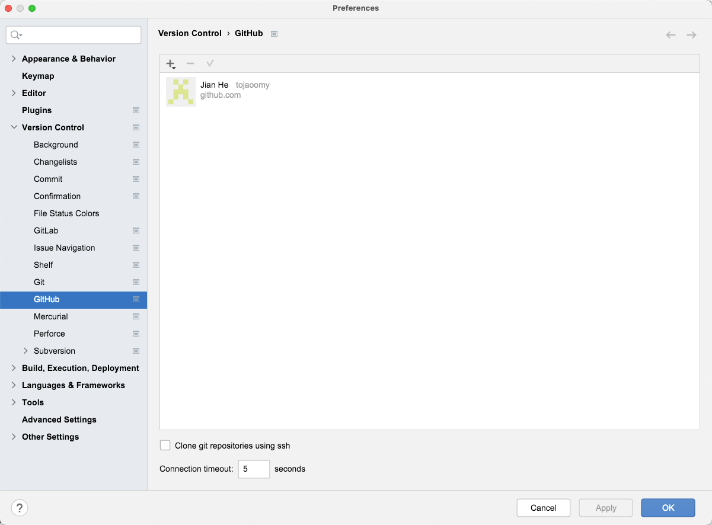

# mybatis-plus-demo
mybatis-plus集成SpringBoot演示

# docker启动MySQL
`docker run --name=mysql1 -p 3306:3306 -e MYSQL_ROOT_PASSWORD=123456 -d mysql`

# IDEA自定义配置Github(公司内部组织有gitlab，已配置ssh)
- 配置本地user.name `git config --local user.name "tojaoomy" `
- 配置本地user.email `git config --local user.email "tojaoomy@foxmail.com" `
- 配置Idea 
- 左上角添加 github账号登录

# Rest本地接口访问
http://localhost/doc.html

# graphql本地访问
http://localhost/graphiql

## maven依赖
<dependency>
    <groupId>com.graphql-java</groupId>
    <artifactId>graphiql-spring-boot-starter</artifactId>
    <version>5.0.2</version>
</dependency>
就可以在 /graphiql 里看到，但这只适用于 graphql 接口在 /graphql 的默认情况，如果有调整就还需要独立客户端。
## 安装 graphql-playground
`https://github.com/graphql/graphql-playground/releases`
mac启动应用

## 官方文档
https://graphql.org/learn/  
https://graphql.cn/learn/schema/

## 学习资料
https://www.graphql-java.com/tutorials/getting-started-with-spring-boot  
https://www.howtographql.com/basics/0-introduction/  
别名 https://graphql.cn/learn/queries/#aliases  
代码生成 https://www.graphql-code-generator.com/plugins/java 
订阅 https://www.graphql-java.com/documentation/subscriptions   
生成JSON Schema https://www.npmjs.com/package/graphql-2-json-schema